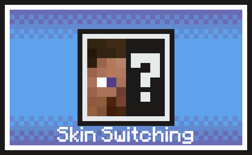

# Skin Switching · 多版本皮肤切换



**作者：幼幼紫**

输入正版玩家名，轻松切换皮肤，支持本地显示与联机同步。

使用 `/Skin Switching SXUUZ` 即可换肤，提供“仅自己可见”与“联机同步”两种独立安装包。

## 下载

[最新多版本安装包 0.2.2](https://github.com/uuzsx/skin-switching/releases/tag/v0.2.2) · [1.21.1 安装包 0.1.1](https://github.com/uuzsx/skin-switching/releases/tag/v0.1.1)

在 Releases 的 **Assets** 中下载对应 JAR；`Source code` 是开发源码。每个游戏实例仅安装一个 JAR。

| Minecraft | 仅自己可见 | 联机同步 |
| --- | --- | --- |
| 1.21.1 | [客户端版](https://github.com/uuzsx/skin-switching/releases/download/v0.1.1/skin-switching-1.21.1-0.1.1-client.jar) | [同步版](https://github.com/uuzsx/skin-switching/releases/download/v0.1.1/skin-switching-1.21.1-0.1.1-sync.jar) |
| 1.21.2 | [客户端版](https://github.com/uuzsx/skin-switching/releases/download/v0.2.2/skin-switching-1.21.2-0.2.2-client.jar) | [同步版](https://github.com/uuzsx/skin-switching/releases/download/v0.2.2/skin-switching-1.21.2-0.2.2-sync.jar) |
| 26.1.1 | [客户端版](https://github.com/uuzsx/skin-switching/releases/download/v0.2.2/skin-switching-26.1.1-0.2.2-client.jar) | [同步版](https://github.com/uuzsx/skin-switching/releases/download/v0.2.2/skin-switching-26.1.1-0.2.2-sync.jar) |
| 26.1.2 | [客户端版](https://github.com/uuzsx/skin-switching/releases/download/v0.2.2/skin-switching-26.1.2-0.2.2-client.jar) | [同步版](https://github.com/uuzsx/skin-switching/releases/download/v0.2.2/skin-switching-26.1.2-0.2.2-sync.jar) |
| 26.3 | [客户端版](https://github.com/uuzsx/skin-switching/releases/download/v0.2.2/skin-switching-26.3-0.2.2-client.jar) | [同步版](https://github.com/uuzsx/skin-switching/releases/download/v0.2.2/skin-switching-26.3-0.2.2-sync.jar) |

1.21.1 使用 NeoForge 21.1.251 或更新的 21.1.x、Java 21；[该版本源码与详细说明](https://github.com/uuzsx/skin-switching/tree/v0.1.1)。当前 `main` 分支对应下面的四个游戏版本。

## 选择游戏版本

| Minecraft Java 版 | NeoForge 最低要求 | Java | 安装包数量 |
| --- | --- | --- | --- |
| 1.21.2 | 21.2.1-beta | 21 | 客户端版、同步版各一份 |
| 26.1.1 | 26.1.1.15-beta | 25 | 客户端版、同步版各一份 |
| 26.1.2 | 26.1.2.71 | 25 | 客户端版、同步版各一份 |
| 26.3 | 26.3.0.31-beta | 25 | 客户端版、同步版各一份 |

游戏版本必须匹配。满足表中最低要求的现有 NeoForge 可以保留，无需为了本模组升级到最新构建。标有 `beta` 的是 NeoForge 官方测试构建。

**兼容修复沿用 0.2.1 的设置**：Minecraft 26.1.2 的 NeoForge 最低要求从 `26.1.2.112` 降至 `26.1.2.71`，兼容 `26.1.2.109`。0.2.2 和 0.1.1 更新作者、简介与 Logo，所有游戏版本的功能、指令、保存格式、同步协议及 NeoForge 最低要求保持原样。

**26.4 暂未提供安装包。** 2026-09-28 核对时，Minecraft 正式版清单没有 26.4，仅有 `26.4-snapshot-1`，NeoForge 也没有 26.4 构建。不能通过放宽版本声明来承诺兼容尚不可构建的版本。

版本依据：[Mojang 官方版本清单](https://piston-meta.mojang.com/mc/game/version_manifest_v2.json)、[NeoForge 官方版本清单](https://maven.neoforged.net/api/maven/versions/releases/net/neoforged/neoforge)。Java 25 要求见 [NeoForge 26.1 移植说明](https://neoforged.net/news/26.1release/)。

## 安装哪一份

下载对应游戏版本的 JAR，或解压 `skin-switching-0.2.2-all-versions.zip` 后按游戏版本和模式选择。1.21.1 的模组版本号为 0.1.1，其余四个游戏版本为 0.2.2。

关闭游戏，将旧版 Skin Switching JAR 从 `mods` 文件夹移出，再放入对应新版；配置和已保存的皮肤选择可以保留。从以下两种模式中选一个：

- `-client.jar`：只放进自己客户端的 `mods` 文件夹，只有自己看到替换效果，服务器不需要安装。
- `-sync.jar`：服务器与所有玩家都放入同一游戏版本的同步版，服务器保存选择并同步外观。

**每个游戏实例只安装一个 Skin Switching JAR。** 两种模式不能叠装，不同游戏版本也不能叠装。联机版使用必需的同步通道，服务器与客户端不能混用本地版和同步版。

1.21.1 的作者、简介与 Logo 更新包见 [v0.1.1 Release](https://github.com/uuzsx/skin-switching/releases/tag/v0.1.1)。

## 指令

```text
/Skin Switching SXUUZ
/skin switching SXUUZ
/skin set SXUUZ
/skin reset
/skin status
```

前三条效果相同：按用户名换肤；`reset` 恢复自己的原皮肤；`status` 查看当前模式和选择。也支持 `/skinswitch switching SXUUZ`。

普通玩家即可使用，不要求 OP 或开启作弊，只修改自己的外观。切换后按 F5 或打开背包查看；皮肤第二层与手臂粗细随目标皮肤变化，披风和鞘翅外观保持自己的。玩家名、UUID、背包、权限、聊天身份和官网账号皮肤均不改变。

## 保存和失败处理

客户端版的选择保存在游戏目录 `config/skin-switching-client.json`；同步版保存在世界目录 `data/skin-switching.json`。按玩家 UUID 保存，登录时重新应用。图片缓存位于客户端 `skin-switching-cache`，关闭游戏后可清理。

两次查询至少间隔 5 秒，恢复不受此限制。成功资料缓存 10 分钟；记录的是切换时的皮肤，不会持续追踪目标用户之后的换肤。

查询官方资料使用 `api.mojang.com`、`sessionserver.mojang.com`，图片来自 `textures.minecraft.net`，均通过 HTTPS。无需提供任何账号密码或访问令牌。客户端验证 Mojang 皮肤签名；下载失败时保留当前外观，恢复会取消尚未完成的切换。

同步版会先保存选择，再通知客户端下载；个别客户端下载失败时仍可能显示旧外观，网络恢复后可重新执行换肤指令或重连。不存在的用户名、没有可用自定义皮肤、官方限流及存档失败都会显示提示。

## 构建完整源码

需要 JDK 25；构建 1.21.2 子项目还需要本机安装 JDK 21。Gradle 会选择对应工具链。首次构建需要联网。

```powershell
.\gradlew.bat build
.\gradlew.bat :mc1212:build
.\gradlew.bat :mc2611:build
.\gradlew.bat :mc2612:build
.\gradlew.bat :mc263:build
```

macOS/Linux 使用 `./gradlew`。每个子项目的 `build/libs` 中会生成客户端版、同步版及源码 JAR。

- `shared`：查询、命令、存储、服务器同步、语言资源与自动测试。
- `legacy`：1.21.2 的皮肤显示与纹理接口。
- `modern`：26 系列的 `PlayerSkin`、`ClientAsset`、纹理下载器和身份资料接口。
- `versions.json`：各游戏版本、NeoForge 最低构建、Java 工具链和依赖范围；`modVersion` 可覆盖该游戏版本的模组版本号。

```powershell
.\gradlew.bat test
.\scripts\smoke-matrix.ps1
.\scripts\smoke-matrix.ps1 -Projects mc2612
# 用最低版本编译的类，在指定的 NeoForge 版本运行：
.\scripts\smoke-matrix.ps1 -Projects mc2612 -NeoForge @{mc2612='26.1.2.109'} -ReuseMainClasses
```

冒烟测试会逐个打开游戏，创建工程内部的临时测试世界，执行实际换肤和恢复指令，再自动退出。脚本会临时切换共用模式标记，并在退出时恢复，**不要与其他构建任务同时运行**。测试代码不会打进发布 JAR。

开发客户端显式传入占位参数 `--accessToken 0`，用于避免 26 系列开发启动器自动启用离线认证服务，从而保留 Mojang 公钥签名校验。这不是账号凭据，正常安装发布版 JAR 不需要设置这个参数。

## 兼容性

其他接管皮肤、玩家模型或 `/skin` 指令的模组可能冲突；指令冲突可先试 `/skinswitch`。YSM 等自带材质的自定义模型不保证采用本模组皮肤。具体测试结果与未验证场景见 `TESTING.md`。

原创代码使用 MIT 许可证，Gradle Wrapper 的许可另见 `THIRD_PARTY_NOTICES.md`。
